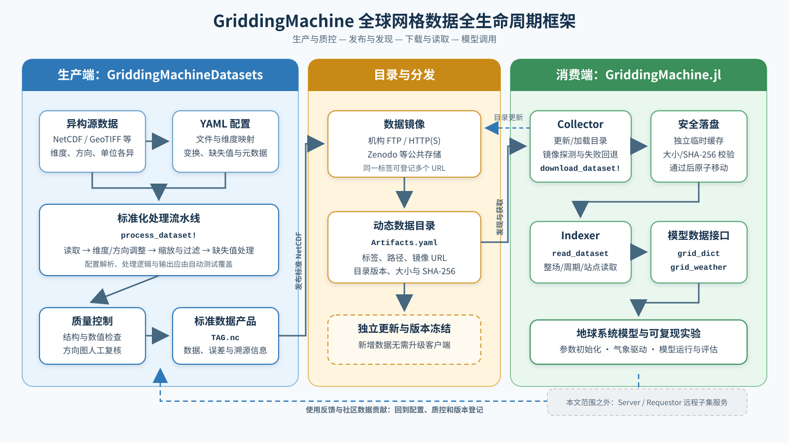

# GriddingMachine：面向地球系统模拟的全球网格数据全生命周期管理框架

**姜皓（Hao Jiang）**^1，[其他作者待定]^1，**王玉杰（Yujie Wang）**^1*

1. 中国科学技术大学[二级单位待确认]，安徽 合肥 [邮政编码待确认]

\* 通讯作者：王玉杰，[邮箱待确认]

## 摘要

地球系统模型的参数化、初始化、驱动和评估依赖来源广泛、格式各异的全球网格数据，但数据发现、格式转换、质量控制、稳定获取和模型适配仍需要大量重复劳动。本文在 2022 年发布的 GriddingMachine 基础上，设计面向全球网格数据的生产—质控—发布—发现—下载—读取—模型调用全生命周期框架。新版框架采用 YAML 描述数据处理与目录信息，将标准化 NetCDF 作为直接分发单元，并提供动态目录、多镜像回退和缓存落盘机制；同时通过统一读取接口以及模型参数字典和气象驱动接口，衔接数据产品与地球系统模型。本文将利用具有不同维度顺序、坐标方向、数值缩放和缺失值特征的合成 NetCDF，以及多操作系统、多网络环境和故障注入实验，对数据转换正确性、传输效率、下载可靠性和模型输入准备过程进行验证。【定量结果待实验完成后填写。】研究旨在将 GriddingMachine 从数据下载工具扩展为可复现的全球网格数据生命周期基础设施，为地球系统数据的标准化共享、持续维护和模型复用提供统一路径。

**关键词：** 地球系统模型；全球网格数据；数据标准化；NetCDF；科学数据基础设施；可复现研究

## 1 引言

地球系统模型正在以更高的空间分辨率和更精细的过程表达描述陆地、大气、海洋及其相互作用。模型复杂度的提升使参数化、初始条件、边界条件、气象驱动和结果评估越来越依赖多源全球网格数据。此类数据通常由不同研究团队和业务机构生产，在文件格式、空间投影、维度顺序、经纬度方向、时间组织、单位、缩放方式、缺失值表示和元数据完整性等方面存在差异。研究人员因此不仅需要寻找数据，还需要反复完成下载、重投影、重排、缩放、质量检查和模型接口适配。数据“可以获得”并不等同于能够被模型稳定、正确且可重复地使用。

科学数据管理正在由单纯的数据公开转向强调可发现、可获取、可互操作和可复用的 FAIR 原则[1]。NetCDF 具有自描述、跨平台和适合多维数组等特点，已广泛用于地球科学数据交换；CF 元数据约定进一步通过坐标、物理量、单位和时空属性描述促进不同数据源之间的解释与处理[2]。Google Earth Engine 等云平台显著提升了大尺度遥感数据的访问和分析能力[3]。然而，对于尚未进入统一云平台、保存在不同机构服务器或研究团队本地的数据，特别是需要离线使用、版本固定或直接进入地球系统模型的数据，研究人员仍然面临格式不一致、分发位置分散、目录更新与软件版本耦合以及模型输入转换重复等问题。

王玉杰等[4]于 2022 年提出 GriddingMachine，将常用于陆面和地球系统模拟的全球数据处理为具有统一空间和变量约定的 NetCDF 文件，并通过标签、`Artifacts.toml` 和 Julia artifact 机制实现数据管理和自动下载，同时提供 Julia、Matlab、Octave、Python 和 R 接口。该版本降低了全球网格数据发现和调用的门槛，并明确了经纬度方向、空间分辨率、变量名称、缺失值、单位、引用信息和处理日志等数据规范。但是，旧版采用 `tar.gz` 作为分发单元，数据目录随软件发布更新，数据镜像和贡献流程的扩展能力有限；当数据存储位置、网络环境和软件接口持续变化时，数据生产、发布、更新和模型使用之间仍缺少统一且可验证的闭环。

针对上述问题，本研究将 GriddingMachine 的关注范围由“标准化数据集合与下载工具”扩展为全球网格数据全生命周期框架。在生产端，使用 YAML 描述原始文件、坐标与数值处理、缺失值和输出信息，并在论文实验版本中补充显式维度映射，形成可测试的数据标准化与质量控制流程；在分发端，以可直接读取的 NetCDF 文件替代二次压缩制品，并通过独立更新的数据目录组织多个镜像和缓存文件；在数据使用端，统一数据下载与读取接口，并通过 `grid_dict` 和 `grid_weather` 将多个数据标签组织为模型参数和气象驱动。远程子集服务 Server/Requestor 不属于本文验证范围。

本文拟回答以下四个问题：不同维度和数值特征的原始 NetCDF 能否被生产流程正确标准化；取消二次打包能否改善端到端的数据获取效率；动态目录、多镜像回退、缓存和哈希校验能否提高跨平台、跨网络条件下的可靠性；统一读取与模型接口能否减少模型输入准备的人工步骤。为此，本文将结合合成数据矩阵、真实数据案例、压缩对比、多操作系统与多网络测试、下载故障注入以及模型端到端案例进行验证。本文其余部分首先介绍系统架构、数据标准和关键实现，随后说明验证方案并报告结果，最后讨论该框架对可复现地球系统数据使用的意义、适用边界和未来发展方向。

## 2 系统设计与方法

### 2.1 总体架构与数据生命周期

GriddingMachine 新版由数据生产、目录与分发、数据使用三个相互衔接的部分组成（图1）。数据生产端由 `GriddingMachineDatasets` 承担，负责把来源、结构和数值约定不同的地学数据转换为满足 GriddingMachine 规范的 NetCDF 产品；目录与分发部分负责保存标准数据产品、维护标签与镜像地址之间的映射，并使数据目录能够独立于 `GriddingMachine.jl` 软件包版本更新；数据使用端由 `GriddingMachine.jl` 承担，负责数据发现、下载、落盘、读取以及向地球系统模型提供参数和气象驱动。三部分共同形成“生产—质控—发布—发现—下载—读取—模型调用”的数据生命周期。

**图1 GriddingMachine 全球网格数据全生命周期框架** 生产端利用 YAML 配置驱动数据标准化和质量控制，目录与分发层维护标准 NetCDF 产品及其镜像，数据使用端完成目录加载、数据下载、缓存落盘、统一读取和模型数据组织。虚线表示独立更新、社区反馈或需要在论文实验版本中完成验证的机制；Server/Requestor 远程子集服务不属于本文验证范围。

**Fig. 1 Lifecycle framework of global gridded data in GriddingMachine.** The production component uses YAML configurations to drive data standardization and quality control. The catalog and distribution component maintains standardized NetCDF products and their mirrors. The data-use component loads the catalog, downloads and stores files through a cache, provides unified data access, and organizes model parameters and meteorological forcing. Dashed lines indicate independent updates, community feedback, or mechanisms to be validated in the experimental release. The Server/Requestor service for remote data subsetting is outside the scope of this study.

在生产端，原始数据及其处理规则分别作为数据输入和 YAML 配置输入。当前 YAML 描述原始文件组合、源变量、经纬度方向、数值变换、有效范围、缺失值处理及输出元数据；论文实验版本将进一步加入显式维度映射。`process_dataset!` 根据配置枚举需要处理的数据文件，依次调用读取、验证和保存过程，最终生成以统一标签命名的 `TAG.nc`。生产过程中的质量控制包括可自动断言的结构与数值检查，以及用于补充确认空间方向的图形复核。自动检查必须成为合成数据测试矩阵的一部分，人工复核不能替代维度、坐标、数值范围和缺失值处理的程序化验证。

通过质量控制的数据产品被发布到机构 FTP、HTTP(S) 服务或 Zenodo 等公共存储位置。一个数据标签可以对应多个镜像地址，并在 `Artifacts.yaml` 中登记标签、相对路径和 URL。目录文件与 `GriddingMachine.jl` 软件包分开维护，使数据列表可以在不发布新软件版本的情况下更新。当前目录尚未记录文件大小和 SHA-256，下载过程也未执行内容哈希校验，因此本文不把现有实现表述为已经保证镜像内容一致或文件完整性。

在数据使用端，Collector 负责初始化、更新和加载目录，并由 `download_dataset!` 完成镜像排序、失败回退和文件下载。当前代码先把文件下载到 `cache` 目录，在某个下载调用未抛出异常后退出镜像循环，再把缓存文件移动到 `public` 数据目录；这一过程尚未比较文件大小或内容哈希。Indexer 随后通过 `read_dataset` 提供整场、指定周期及站点数据读取，并通过 `grid_dict` 和 `grid_weather` 将多个标签组织为模型参数集合和气象驱动。由此，数据产品沿统一接口进入模型初始化、运行与评估过程。

该生命周期不是单向发布链。模型使用过程中发现的数据错误、元数据不足和新增数据需求可以反馈至 YAML 配置、质量控制和版本登记环节，形成持续维护机制。本文评价的重点是上述本地数据生产、可靠分发、统一读取和模型接口闭环；考虑到网络服务部署与端口安全涉及不同的技术问题，Server/Requestor 不纳入本文核心架构与实验评价。

### 2.2 数据标准与 YAML 驱动的生产流程

#### 2.2.1 标准 NetCDF 数据模型

GriddingMachine 以 NetCDF 作为标准数据格式，原因是该格式能够在同一文件中保存多维数组、坐标和自描述元数据，并被多种地球科学软件读取。2022 年版本已经规定数据采用二维或三维规则经纬网，前两维依次为经度和纬度，可选第三维表示周期；经度自西向东、纬度自南向北，数据不保留未说明的缩放，缺失值在读取后统一表示为 `NaN`，主变量和不确定性变量分别命名为 `data` 和 `std`[4]。新版延续这些核心约定，并将维度映射、溯源信息、处理配置和分发完整性纳入可机器检查的规范（表2）。

**表2 GriddingMachine 标准 NetCDF 数据与元数据规范**

| 类别 | 论文实验版本要求 | 验收重点 |
|---|---|---|
| 文件与网格 | 一个标签对应一个可直接读取的 `.nc`；规则经纬度网格，默认全球覆盖并声明坐标参考 | 文件可打开；坐标范围、间距和单调性正确 |
| 维度 | 二维 `(lon, lat)`；三维 `(lon, lat, ind)`；源维度按名称映射到标准顺序 | 对不同维度排列进行逐点金标准比较 |
| 坐标方向 | `lon` 自西向东并统一到 `[-180, 180)`；`lat` 自南向北 | 翻转和循环平移后数值位置正确 |
| 数据变量 | `data` 必需；`std` 可选但必须与 `data` 同形；输出为实际物理值 | 变量、形状、类型、单位和数值正确 |
| 缺失值与范围 | 读取接口统一返回 `NaN`；有效范围、填充值和 gap-filling 规则显式记录 | 缺失值掩膜及各种填补策略符合预期 |
| 变量元数据 | 至少包含单位、可读说明；可映射时使用 CF `standard_name`[2] | schema、单位和标准名检查 |
| 数据溯源 | 记录来源、引用/DOI、许可、处理历史、生成时间和责任主体 | 必填属性完整且链接有效 |
| 处理复现 | 记录生产软件 commit/release、YAML schema 版本和配置哈希 | 能由同一配置重建并对应实验清单 |
| 标签与版本 | 标签表达类别、空间/时间分辨率、年份、版本和可选修订号 | 格式合法、全目录唯一、与文件名一致 |
| 分发完整性 | 目录记录文件字节数和 SHA-256；同一标签各镜像内容相同 | 下载后校验；失败文件不能进入正式目录 |

**Table 2 Standardized NetCDF data and metadata requirements of GriddingMachine.** Each requirement is evaluated by automated tests against the frozen experimental release. A detailed working table, including field-level checks, is maintained with the manuscript materials.

CF 约定不强制固定维度顺序，而是利用坐标变量和属性表达数据含义[2]。GriddingMachine 进一步固定输出维度顺序，是为了降低下游模型接口的复杂度；但生产端不能假设所有源数据已经采用这一顺序。因此，论文实验版本的 YAML schema 需要显式记录源变量各维度的语义，将 `(lat, lon)`、`(ind, lat, lon)` 等排列重排为统一输出，并通过坐标值而非仅凭数组位置判断翻转和循环平移操作。对于非规则网格、区域投影或无法无损映射到规则经纬网的数据，流水线应给出明确错误或进入数据源专用的预处理步骤，而不能静默生成看似合规的文件。

#### 2.2.2 YAML 配置结构

YAML 将数据源差异与通用处理代码分离。当前配置由四类顶层字段组成：`FILE` 描述文件命名模式及 `PREFIX`、空间分辨率 `NX`、时间分辨率 `MT`、可选年份 `YYYY` 和数据版本 `VV`；`FOLDER` 指定原始数据与标准化数据目录；`DATA` 及可选的 `STD` 描述源变量名称、单位、缩放、有效范围、经纬度变换、缺失值策略和处理日志；`GRIDDINGMACHINE` 定义标签及可选修订号。一个配置可以包含多组前缀、分辨率、时间尺度、年份和版本，流水线对其笛卡尔组合逐项生成目标文件。

为避免配置错误在长流程末端才暴露，论文实验版本将为 YAML 增加 `schema_version` 并在读取数据前完成结构校验。字段分为必需字段、具有明确默认值的可选字段和互斥字段；数组长度必须与变量前缀一一对应。维度映射、坐标变量、缺失值、单位、引用、许可和输出属性均由 schema 约束。旧版遗留的 `TARBALL` 字段从生产配置中删除，YAML 网页生成器与处理流水线必须由同一 schema 驱动，确保网页生成的最小配置能够直接运行。以 `wyujie@51cf0fe` 为基线的21份 YAML 尚未完全满足这一要求，例如 `GAPFILL` 并非全部配置均具备，而当前读取函数将其作为必需字段；这些差异将在正式实验前通过 schema 迁移和配置测试消除。

#### 2.2.3 数据处理顺序与可追溯输出

`process_dataset!` 首先根据 `FILE` 和 `FOLDER` 定位输入与输出文件，再读取 `DATA` 和可选 `STD` 指定的源变量。当前流水线将数据转换为 `Float32`，依次执行纬度翻转、经度翻转或从 `0～360°` 到 `-180～180°` 的循环平移、线性缩放、有效范围过滤和缺失值处理。处理顺序本身是结果可复现的一部分，因而不能只保存最终数组；每项实际执行的转换都应写入 `history`，并将完整 YAML、配置 SHA-256 和生产代码版本与输出关联。

论文实验版本的自动质量控制将在保存前检查维度、坐标、变量、数值范围和缺失值规则。当前已有的空间方向图可用于人工发现异常，但只作为补充审核；流水线的正确性应由具有已知预期输出的合成 NetCDF 自动断言。验证通过后生成 `data`，存在不确定性时追加同形的 `std`，并按 `TAG_(PREFIX_)NX_MT_(YYYY_)VV(_REVISION)` 生成唯一文件名。若目标文件已存在，流水线不能仅凭文件名跳过，而应比较配置哈希、软件版本和文件校验结果，以区分可安全复用的输出与需要重建的过期或不完整文件。

### 2.3 数据质量检查与目录登记

#### 2.3.1 处理过程中的方向验证

当前生产流水线在 `read_input` 完成经纬度翻转、经度范围调整、线性缩放、有效范围过滤和缺失值处理后，调用 `verify_data!` 对待保存数组进行方向检查。该函数先将数组写入固定的 NetCDF 缓存文件，再调用 Python 脚本生成全球分布图；操作者查看图件后在终端输入 `Y/y` 表示通过，其他输入则终止当前数据的保存。YAML 中的 `VERIFY_ONCE` 用于控制同一配置组合是否只在第一次处理时进行人工确认，通过状态临时写入配置字典的 `VERIFIED` 字段。

这一过程主要用于识别南北颠倒、东西颠倒或经度平移错误，属于交互式人工检查。当前代码使用固定缓存文件名、默认调用 `python3`，审核结论也没有写入最终 NetCDF 或独立记录，因此不适合直接作为无人值守的批处理证据。本文对当前功能的表述限定为“提供空间方向人工验证步骤”，不称其为完整的自动质量控制系统。

#### 2.3.2 标准文件检查

对于已经生成的 NetCDF 文件，`verify_processed_data!` 提供独立的结构和数值检查。该函数首先确认文件存在，并要求覆盖类型为全球陆地和海洋（`both`）或陆地（`land`）。随后检查 `lon`、`lat` 维度和坐标变量、主变量 `data`，当文件具有三个及以上维度时进一步要求 `ind`；同时比较 `data` 各维长度与 `lon`、`lat` 和 `ind` 长度是否一致。数值检查读取完整的 `data` 数组，计算忽略 `NaN` 后的最小值和最大值，并判断其是否位于给定范围内。

缺失值检查取决于覆盖类型。`both` 要求整个数组不存在 `NaN`；`land` 在经度长度为360、720或1 440时读取并重采样 `LM_4X_1Y_V1` 陆地掩膜，逐层检查陆地区域是否含 `NaN`。其他空间分辨率下，代码给出警告并跳过陆地缺失值检查。当前函数尚未检查经纬度坐标的实际取值和单调方向，也未检查 `std`、单位、引用信息和处理日志；这些边界将在验证实验中明确报告。

#### 2.3.3 标签生成与数据目录登记

数据文件名由 `griddingmachine_tag` 生成，基本形式为 `TAG_(PREFIX_)NX_MT_(YYYY_)VV(_REVISION)`。其中 `NX` 表示空间分辨率，`MT` 表示时间分辨率，`YYYY` 和 `REVISION` 为可选部分。生成输出路径时，代码读取当前 `Artifacts.yaml`，如果拟生成标签已经存在则触发断言，从而避免直接产生同名数据文件。

当前的数据发布与登记尚未组成全自动流程。标准 NetCDF 需要先上传至 Zenodo，机构 FTP 副本也需要单独准备；现有 `update_yaml_library!` 脚本尝试从 Zenodo 记录网页提取 `.nc` 文件链接，根据文件名生成标签，并向 `Artifacts.yaml` 条目写入 `PATH` 以及 Zenodo、FTP URL。已有标签会追加新的 URL，新标签则创建目录项，最后对目录排序并写回文件。FTP 上传在代码中仍为 TODO，服务器地址、目录路径和 Zenodo 记录号也采用固定值；脚本还存在变量名不一致和模块加载时直接执行的问题。因此，本文将其描述为“辅助生成目录条目的开发脚本”，不称为已经实现的自动发布系统。

仓库中的 `verify_urls!` 用于初步检查目录地址。它先对各服务器执行 ping，再通过 FTP 目录查询或 HTTP GET 判断文件是否存在，并将异常地址写入日志。但当前全库函数在检查前10个标签后即停止，HTTP 请求关闭了 TLS 证书校验，而且禁止 ICMP 的可用服务器会被直接视为不可访问。由此，现有代码可以辅助抽查部分 URL，不能证明全部1 179个标签均可访问，也不能证明多个 URL 指向内容相同的文件。当前 `Artifacts.yaml` 仅保存 `PATH` 和 `URL`，尚无文件大小或内容哈希字段。

### 2.4 动态目录与多镜像分发

#### 2.4.1 本地目录初始化与加载

`GriddingMachine.jl` 通过 Collector 模块管理数据目录和本地文件。当前代码将工作目录固定为用户主目录下的 `GriddingMachine`，其中 `Artifacts.yaml` 保存数据目录，`cache` 保存下载过程中的缓存文件，`public` 按目录条目中的 `PATH` 保存正式 NetCDF。Collector 模块加载时创建这些目录，并立即调用 `load_database!` 读取 `Artifacts.yaml`，将目录内容和标签分别保存在全局变量 `YAML_DATABASE` 和 `YAML_TAGS` 中。如果本地目录文件不存在，软件包会先访问 Zenodo 下载目录，再完成解析。

目录条目以数据标签为键，当前包含 `PATH` 和 `URL` 两类信息。`dataset_found` 判断标签是否存在；`dataset_path`、`dataset_dir`、`dataset_cache` 和 `dataset_url` 分别返回正式文件路径、目标目录、缓存路径和下载地址数组。该结构使目录内容可以独立于 `GriddingMachine.jl` 的发布版本更新，但也意味着首次加载软件包时可能发生目录创建和网络访问。当前实现没有离线模式或可配置的数据根目录，本文将这一行为作为现有软件边界，而不表述为无副作用的初始化过程。

#### 2.4.2 数据目录更新

`update_database!` 调用 `download_database!` 获取远端目录，随后重新执行 `load_database!` 并更新内存中的标签列表。远端入口目前固定为一个 Zenodo 记录页面。`download_database!` 首先下载该页面的 HTML 文本，查找包含 `Artifacts.yaml?download=1` 的行，从中截取实际文件记录号和下载地址。软件包同时在本地 `Zenodo` 文本文件中保存上次记录号；当远端记录号、本地记录号和目录文件均存在且一致时跳过下载，否则最多重试3次下载 `Artifacts.yaml`，并写入新的记录号。

该机制已经实现“目录更新与软件包版本分离”，但更新过程依赖 Zenodo 网页的具体文本结构，而不是结构化 API。目录文件直接写入正式路径，记录号也在同一下载过程内更新；当前代码没有在替换前执行 YAML 结构检查，也没有保留上一目录版本。因此，本研究可以验证软件包是否发现并加载新目录记录，但不能据现有代码声称目录更新具有原子性或自动回滚能力。

#### 2.4.3 多镜像排序与失败回退

`download_dataset!` 接收一个数据标签。如果标签不在当前内存目录中，函数先调用 `update_database!` 刷新目录；刷新后仍不存在则报错。若对应 NetCDF 已位于正式路径，函数直接返回本地文件，不再访问网络。需要下载时，函数取得该标签的全部 URL，提取各 URL 的服务器地址，调用 `ip_address_ping` 测量往返时间，并按测得时间由小到大排列镜像。

当前 `ip_address_ping` 执行 `ping -c 2 -W 2`，分别解析 macOS 的汇总行或 Linux 的 `time=` 输出；命令失败、输出格式不匹配或无法解析时返回 `Inf`。下载循环按排序结果依次尝试镜像：遇到 `Inf` 时报告服务器不可达；`Downloads.download` 抛出异常时记录警告并继续下一个 URL；某次调用未抛出异常时退出循环。这一实现体现了“优先尝试网络往返时间较短的镜像，并在下载异常时回退”的基本逻辑。

镜像排序目前存在两项明确边界。第一，Windows 的 ping 参数和输出格式与当前实现不同，因此 Windows 上可能把所有镜像判断为不可达；服务器禁用 ICMP 时，即使 HTTP 或 FTP 文件可访问也会得到 `Inf`。第二，ping 反映的是 ICMP 往返时间，不等同于文件协议连接时间、首字节时间或实际传输吞吐率。因而本文在完成跨平台实验前，只称该方法为“基于 ping 的镜像排序”，不称为跨平台最优镜像选择。

#### 2.4.4 缓存落盘与批量同步

每个标签使用 `cache/<TAG>.nc` 作为缓存文件。下载循环结束后，代码创建 `Artifacts.yaml` 中指定的目标目录，并通过 `mv` 将缓存文件移动到正式路径。该设计使正在下载的文件与 `public` 中供读取的数据分离，降低未完成下载直接以正式路径出现的可能性。`sync_database!` 在更新目录后遍历全部标签并调用 `download_dataset!`，每个标签之间暂停1秒，可用于顺序同步整个目录。

当前缓存流程不检查响应内容、文件大小或哈希，也没有独立的下载成功状态。如果所有具有有限 ping 的镜像均在下载时抛出异常，循环结束后仍会执行 `mv`；此时可能因缓存不存在而报错，也可能移动之前残留的同名缓存。现有 `Artifacts.yaml` 不含哈希字段，因此无法判断下载内容是否完整或多个镜像是否一致。本文将通过下载中断、截断文件、错误响应和全部镜像失败等案例验证这些边界；在当前代码未修改前，不使用“完整性保证”或“安全原子下载”等表述。

### 2.5 统一读取与模型接口

#### 2.5.1 `read_dataset` 统一读取接口

Indexer 模块使用 `read_dataset` 读取本地 NetCDF 或目录标签。当前接口包含4类重载：读取完整数组；按1起始的周期索引读取二维切片；按纬度和经度读取站点的全部周期；按纬度、经度和周期读取单个值。整场和指定周期重载将以 `.nc` 结尾的字符串直接视为本地路径，站点重载则只有在 `isfile` 返回真时才视为本地文件；其他输入被视为 GriddingMachine 标签并传给 `download_dataset!`。这种判断规则目前并不完全一致。旧名称 `read_LUT` 作为 `read_dataset` 的别名保留，因此已有 Julia 代码仍可调用旧接口。

默认读取变量 `data`。当 `raw_data=true` 且文件包含 `raw_data` 时读取原始变量，否则退回 `data`；当 `read_std=true` 时优先读取 `std`，文件不含 `std` 则返回 `nothing`。接口由 NetcdfIO 完成实际数组读取，没有在这一层进行单位转换、缺失值填补或数据质量修正。周期索引也不解释具体月份、日期或小时，调用者需要预先知道第三维的含义和长度。

站点读取根据纬度维长度计算空间分辨率 `res=180/nlat`，再由 `floor((lat+90)/res)+1` 和 `floor((lon+180)/res)+1` 得到数组索引。大于180°的经度先减去360°，随后经纬度被限制在 `[-180°,180°]` 和 `[-90°,90°]`。这一实现依赖数据已经采用全球规则经纬网、`(lon,lat[,ind])` 顺序以及西向东、南向北排列；函数没有读取实际坐标值，也没有进行双线性插值。位于90°纬线或180°经线的端点可能得到超出格点数的索引，区域数据和非规则网格同样不满足当前索引假设。

#### 2.5.2 `grid_dict` 陆地模型参数组织

`grid_dict` 将多个 GriddingMachine 标签组织为单个格点的陆地模型参数字典。当前 `LandDatasetLabels` 支持 `gm1` 和 `gm2` 两组标签，两者使用相同的土壤颜色、van Genuchten 土壤水力参数、冠层高度、叶绿素、叶面积指数、比叶面积、最大羧化速率、地形高程、陆地掩膜和植物功能型数据，主要区别是聚集指数产品。年份用于选择对应的 MODIS 叶面积指数，并用于取得逐月大气 CO₂ 浓度。

按经纬度调用时，函数首先读取陆地掩膜和叶面积指数；目标格点不是陆地或没有正的叶面积指数时直接报错。对于植被格点，函数读取土壤、冠层和叶片变量，对叶绿素、聚集指数、叶面积指数和最大羧化速率的季节序列执行缺失值填补，并重采样为逐日序列。随后根据植物功能型比例和代码内置的 CLM5 参数表计算 C3/C4 Medlyn 模型参数及叶片在可见光和近红外波段的反射率与透射率；叶片质量面积由比叶面积换算，`JMAX25` 和 `B6F` 分别由 `VCMAX25` 乘以固定系数1.73和0.0089得到。

输出字典包括格点位置、分辨率、年份、陆地掩膜、植物功能型比例、CO₂、土壤参数、冠层结构、叶片生物物理参数和光合参数。`verification=true` 时，函数通过 `NaN_test` 断言输出不含未处理的 `NaN`。另一重载可以先构建覆盖全局的 `LandDatasets`，重网格并填补数据，再按数组索引生成植被或裸土格点字典；因此两个入口对非植被陆地格点的处理并不完全一致。代码中还保留 `gm3` 的条件分支，但 `LandDatasetLabels` 构造器只允许 `gm1` 和 `gm2`，该分支从公开构造入口不可达。

#### 2.5.3 `grid_weather` 气象驱动组织

`grid_weather` 用于组织单个格点的逐小时气象驱动。当前 `WeatherDriverLabels` 只支持 `wd1`，并按年份构造8个 ERA5 数据标签，分别对应地表气压、降水、漫射短波辐射、直射短波辐射、长波辐射、气温、水汽压亏缺和风速。按经纬度调用时，函数通过 `read_dataset` 分别读取8个站点时间序列，并转换为调用者指定的浮点类型。

输出为包含 `FDOY`、`PATM`、`PPT`、`RAD_SW_DIF`、`RAD_SW_DIR`、`RAD_LW`、`TAIR`、`VPD` 和 `WIND` 的有序字典。`FDOY` 以逐小时序号为基础，并使用 `lon/15` 形成经度对应的时区偏移；`verification=true` 时同样通过 `NaN_test` 检查输出。另一重载接收已加载的 `WeatherDrivers` 全局数组并按格点索引提取相同字段。

当前模型接口完成的是“按固定标签组合读取并整理数据”，而不是通用模型耦合层。它依赖预定义的 `gm1/gm2` 和 `wd1` 标签、规则网格、既定单位及内置 CLM5 系数，没有在接口层检查单位一致性或记录各字段来源版本；现有测试也尚未给出站点金标准结果。因此，本文现阶段只表述为“提供模型参数字典和气象驱动组织接口”，其数值正确性、年份覆盖、格点边界和模型输入准备效率需要在第3章的端到端案例中验证。

## 3 验证设计

### 3.1 数据生产正确性测试

#### 3.1.1 测试目标与合成数据

数据生产正确性测试用于回答 YAML 驱动流程能否按照配置完成数组变换并生成结构一致的 NetCDF。测试对象固定为正式实验所使用的 `GriddingMachineDatasets` commit，不使用当前工作目录状态代替版本号。全部输入在临时目录内生成，以位置编码数组作为金标准：二维数组中每个格点由经纬度索引共同编码，三维数组再加入周期索引，使维度交换、方向翻转、经度平移和周期错位能够通过逐点比较识别。

测试分为当前支持行为和边界行为两类。支持行为包括标准 `(lon,lat)` 与 `(lon,lat,ind)` 输入、纬度/经度翻转、`0～360°`经度平移、线性缩放、范围过滤、各类缺失值处理、`data/std`保存和标签生成。边界行为包括 `(lat,lon)`、`(ind,lat,lon)`等非标准维度顺序、缺少必需字段、变量标签数量不一致、未知`GAPFILL`以及目标文件已存在等情况。边界案例不预设当前代码能够处理；评价重点是其产生正确结果、明确拒绝，还是静默生成错误文件。

#### 3.1.2 测试矩阵

表3将案例分为维度（D）、坐标（C）、数值（N）、缺失值（G）、YAML配置（Y）、输出（O）和人工验证（V）7组。详细工作表共定义31个案例，并分别记录正确行为和基于`wyujie@51cf0fe`静态代码得到的基线预期。正式论文只填写冻结版本的实测结果，基线预期不作为结果。

**表3 GriddingMachineDatasets 合成 NetCDF 测试矩阵（正文摘要）**

| 组别 | 案例数 | 主要组合 | 核心断言 |
|---|---:|---|---|
| D 维度 | 5 | 2D/3D标准顺序、`(lat,lon)`、`(ind,lat,lon)`、非支持维度 | 输出形状、维度名及逐点位置 |
| C 坐标 | 4 | 纬度翻转、经度翻转、`0～360°`平移、组合变换 | 坐标方向及位置编码值 |
| N 数值 | 4 | Float32、线性缩放、有效范围、有/无缩放 | 最大绝对和相对误差、NaN掩膜 |
| G 缺失值 | 8 | 常数、均值、保留、无陆地NaN、无NaN、整数化和错误方法 | 修改位置、填充值、日志和返回值 |
| Y 配置 | 4 | 最小配置、缺`GAPFILL`、网页生成配置、数组长度不一致 | 成功输出或明确异常 |
| O 输出 | 4 | `data`、`std`、已有文件、标签冲突 | 变量、属性、跳过策略和唯一性 |
| V 人工检查 | 2 | 接受或拒绝方向图 | 是否保存及临时验证状态 |

**Table 3 Synthetic NetCDF test matrix for GriddingMachineDatasets.** The matrix evaluates dimensions, coordinates, numerical transformations, missing-value handling, YAML configurations, output files, and interactive orientation checks. Detailed fixtures and expected outcomes are fixed before code changes; only measurements from the frozen release will be reported as results.

#### 3.1.3 指标与通过标准

每个案例记录结构检查、数值检查和异常检查结果。结构通过要求输出变量、维度、形状和属性与预期一致；数值通过要求逐点结果与金标准一致，Float32转换按预先固定的绝对和相对容差判断；预期失败通过要求函数产生指定类型和阶段的错误，且不留下可被当作正式数据使用的输出。另记录最大绝对误差、最大相对误差、处理日志和重复运行一致性。

全部非交互测试在Linux、macOS和Windows上运行至少3次。论文声称支持的案例必须达到100%的结构和数值通过率；暂不支持的案例必须稳定拒绝，不能静默产生错误结果。人工方向图由至少2名检查者独立判断并保存审核记录，但不计入自动正确率。当前目标分支没有`test/runtests.jl`，本机也没有可用Julia环境，因此本节目前是预先冻结的实验方案，不包含运行结果。

### 3.2 取消二次压缩的效率测试

实验选择二维静态高程`ELEV_4X_1Y_V1`、三维8日叶面积指数`LAI_MODIS_2X_8D_2020_V1`和逐小时气温`TAIR_ERA5_1X_1H_2020_V1`作为不同规模和维度的候选产品。每个标准NetCDF分别以原始`.nc`和包含同一文件的`tar.gz`分发；若旧流程的gzip级别无法确认，则同时测试级别1、6和9。解包后的NetCDF必须与直接文件具有相同SHA-256，确保比较对象的科学内容完全一致。

首先在同机本地HTTP服务上隔离公网波动，随后在可用真实镜像上补充观察。每个组合预热1次并随机顺序重复至少10次，分别记录文件字节数、打包/下载/解包wall time和CPU time、从请求开始到首次读取一个NetCDF值的总时间、峰值临时磁盘占用、最终磁盘占用和峰值内存。冷文件缓存和热文件缓存分开报告，时间指标使用中位数、四分位距和95% bootstrap置信区间。只有直接NetCDF在端到端时间或临时磁盘占用上表现出稳定定量优势时，才将“取消二次压缩提高效率”写入结果。

### 3.3 跨平台、多镜像与故障注入测试

下载验证分为受控镜像和真实镜像两层。受控实验建立两个内容相同、可独立设置延迟和故障的HTTP端点，覆盖两镜像均可用、首选404、超时、连接重置、禁止ICMP但HTTP可用、全部镜像失败、已有同名缓存、截断缓存、返回HTML和中途截断等12个场景。每个场景在Linux、macOS和Windows运行至少20次，记录可达性判断、首选URL、回退次数、最终成功率、各阶段耗时、错误类型以及cache/public文件的大小和SHA-256变化。

真实镜像实验从当前72个具有多个URL的标签中固定3～5个小中型文件，在中科大校内网络和至少一种校外网络重复至少10次，记录FTP和Zenodo的选择、吞吐率和成功率。真实镜像结果只适用于所测子集，不外推到全部1 179个标签。故障实验重点判断正式数据路径是否保持正确状态；当前代码的Windows ping、ICMP误判、无哈希以及全部下载失败后仍可能执行`mv`均作为待验证假设，而不是预先填写的结果。

### 3.4 模型端到端案例

接口验证固定`gm2`陆地参数、`wd1`气象驱动和数据齐全的年份，候选格点包括2022年论文使用的US-NR1附近格点、合肥附近植被格点和一个撒哈拉裸土格点。运行前依据陆地掩膜和LAI确认格点类别。`read_dataset`与NetCDF底层读取逐项比较；`grid_dict`由各标签的手工读取结果独立复现缺失值填补、重采样、PFT加权和派生参数；`grid_weather`由8个ERA5序列独立复现`FDOY`。所有字典字段均进行逐点比较并检查NaN。

在数值一致的前提下，将一次`grid_dict/grid_weather`调用与手工查找标签、逐项读取和派生计算比较，记录非空代码行数、显式调用数、人工输入项数、首次及重复运行时间、下载字节数和峰值内存，每种条件重复至少10次。当前代码只返回模型所需字典，尚未包含完整Emerald运行命令；因此必须在确认Emerald版本、初始化接口、模拟时段和输出指标后，才能增加模型运行结果。若该步骤未完成，最终稿将本节称为“模型数据接口案例”，不声称完成端到端模型模拟。

## 4 结果

【不得在正式实验完成前填写推断性结果。】

## 5 讨论

【待结果完成后撰写，包括与 2022 版、通用数据仓库和云平台的比较，以及规则经纬网、镜像维护和人工审核等局限。】

## 6 结论

【待结果完成后撰写。】

## 数据和代码可用性声明

【投稿前填写最终代码仓库、release tag、数据 DOI、实验脚本与结果归档地址。】

## 作者贡献

姜皓：概念设计、软件、验证、数据整理、可视化、初稿撰写【待作者确认】。王玉杰：概念设计、研究指导、项目管理、论文审阅与修改【待作者确认】。其他作者贡献待实际参与情况确定。

## 利益冲突声明

作者声明不存在利益冲突【投稿前由全体作者确认】。

## AI 工具使用声明

本文准备过程中使用 OpenAI Codex 辅助梳理研究材料、检查论文结构、形成文字初稿和协助代码审查。所有研究问题、方法选择、代码修改、实验设计、数据、结果解释和最终文字均由作者核验并承担责任。投稿前将依据实际使用情况补充工具版本、使用环节和人工核验过程。

## 参考文献

[1] WILKINSON M D, DUMONTIER M, AALBERSBERG I J, et al. The FAIR Guiding Principles for scientific data management and stewardship[J]. Scientific Data, 2016, 3: 160018. DOI: 10.1038/sdata.2016.18.

[2] CF CONVENTIONS COMMITTEE. CF Metadata Conventions[EB/OL]. [2026-08-07]. https://cfconventions.org/.

[3] GORELICK N, HANCHER M, DIXON M, et al. Google Earth Engine: Planetary-scale geospatial analysis for everyone[J]. Remote Sensing of Environment, 2017, 202: 18-27. DOI: 10.1016/j.rse.2017.06.031.

[4] WANG Y, KÖHLER P, BRAGHIERE R K, et al. GriddingMachine, a database and software for Earth system modeling at global and regional scales[J]. Scientific Data, 2022, 9: 258. DOI: 10.1038/s41597-022-01346-x.
