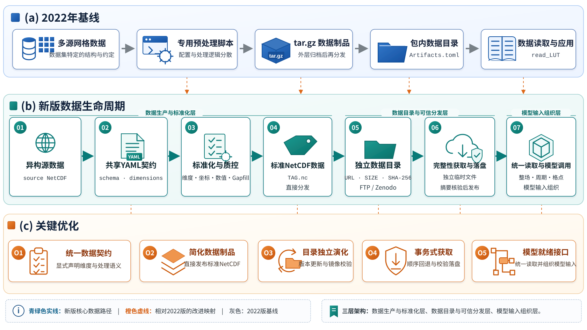
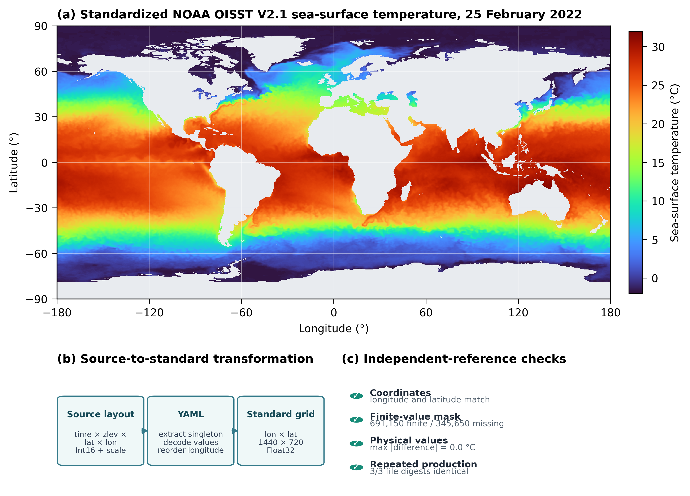
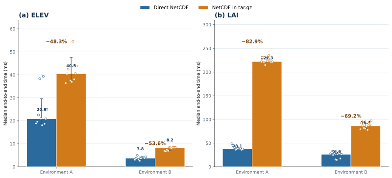

# 面向地球系统模型的全球网格数据生产与可信分发：GriddingMachine框架更新与应用

**姜皓（Hao Jiang）**^1，**王玉杰（Yujie Wang）**^1*

1. 中国科学技术大学地球和空间科学学院，安徽 合肥 230026

姜皓，E-mail：hao.jiang@mail.ustc.edu.cn；ORCID：https://orcid.org/0009-0009-8295-8661

\* 通讯作者：王玉杰，wyujie@ustc.edu.cn

## 摘要

多源全球网格数据在维度结构、坐标方向、数值缩放、缺失值处理和分发位置等方面具有显著差异，对地球系统模型输入的标准化生产与稳定获取提出了统一化需求。本文在2022版GriddingMachine基础上构建贯通数据生产、质量控制、完整性可核验分发、统一读取和模型调用的数据生命周期框架。新版以共享配置规范（schema）和YAML驱动源维度映射、坐标转换、数值变换与缺失值填补（Gapfill），采用独立目录管理逻辑路径、镜像地址及完整性元数据，并通过直接NetCDF与事务式获取连接标准产品和模型应用。NOAA最优插值海表温度（OISST）V2.1产品由四维源结构转换为1440×720标准网格，691 150个有效格点与独立参考逐点一致。对于ELEV和LAI两个内部压缩产品，直接NetCDF在环境A中分别降低48.3%和82.9%的缓存预热端到端中位时间，在环境B中分别降低53.6%和69.2%。校园网内4个代表性产品经FTP和Zenodo完成24次同文件下载，文件大小与SHA-256均与目录登记值一致。14类陆面产品与8类ERA5逐时产品在US-NR1形成参数和气象驱动，8个字段的8784个时间步与底层NetCDF读取逐点一致，并完成Emerald初始化和60 s首步计算。新版GriddingMachine由此形成面向全球规则网格数据的可配置生产、完整性可核验分发和模型输入组织框架，为地球系统数据产品的持续维护与复用提供轻量化基础设施。

**关键词：** 地球系统模型；全球网格数据；数据生命周期；NetCDF；可信分发；数据完整性

**Production and Trustworthy Distribution of Global Gridded Data for Earth System Models: Framework Advances and Applications of GriddingMachine**

**Hao JIANG^1, Yujie WANG^1\***

1. School of Earth and Space Sciences, University of Science and Technology of China, Hefei 230026, China

Hao Jiang, E-mail: hao.jiang@mail.ustc.edu.cn; ORCID: https://orcid.org/0009-0009-8295-8661

\* Corresponding author: Yujie Wang, wyujie@ustc.edu.cn

## Abstract

Multi-source global gridded data differ substantially in dimensional structure, coordinate orientation, numerical scaling, missing-value treatment, and distribution location, creating a demand for standardized production and reliable access to Earth system model inputs. Building on the 2022 release, this study develops GriddingMachine as an integrated lifecycle framework for data production, quality control, integrity-verifiable distribution, unified reading, and model use. A shared schema and YAML configuration drive source-dimension mapping, coordinate and numerical transformations, and gap filling; an independent catalog manages logical paths, mirrors, and integrity metadata; and direct NetCDF with transactional acquisition connects standardized products to model applications. A NOAA Optimum Interpolation Sea Surface Temperature (OISST) V2.1 product was transformed from a four-dimensional source structure to a standardized 1440 × 720 grid, with 691,150 finite cells matching an independently decoded reference point by point. For the internally compressed ELEV and LAI products, direct NetCDF reduced median warm-cache end-to-end time by 48.3% and 82.9%, respectively, in environment A and by 53.6% and 69.2% in environment B. Four representative products were downloaded 24 times from FTP and Zenodo on the campus network, with file sizes and SHA-256 digests matching their catalog records. Fourteen land products and eight hourly ERA5 products supplied land parameters and meteorological forcing for US-NR1; all 8,784 time steps in eight fields matched direct NetCDF reads, and Emerald initialization and a 60 s first step completed with finite states. The updated GriddingMachine provides a lightweight infrastructure for configurable production, integrity-verifiable distribution, and model-input organization of global regular-grid data.

**Keywords:** Earth system modeling; global gridded data; data lifecycle; NetCDF; trustworthy distribution; data integrity

## 1 引言

地球系统模型正在以更高的空间分辨率和更精细的过程表达描述陆地、大气、海洋及其相互作用。模型复杂度的提升使参数化、初始条件、边界条件、气象驱动和结果评估越来越依赖多源全球网格数据。此类数据通常由多个研究团队和业务机构生产，呈现多样的文件格式、空间投影、维度顺序、经纬度方向、时间组织、单位、缩放方式、缺失值表示和元数据结构。研究人员需要串联数据发现、下载、重投影、重排、缩放、质量检查和模型接口适配，进而把“可获得的数据”转化为可稳定、正确且可重复调用的模型输入。

科学数据管理正在由单纯的数据公开转向强调可发现、可获取、可互操作和可复用的FAIR原则[1]。NetCDF具有自描述、跨系统和适合多维数组等特点，CF元数据约定进一步通过坐标、物理量、单位和时空属性促进不同数据源之间的解释与处理[2]。Google Earth Engine等云平台显著提升了大尺度遥感数据的访问和分析能力[3]。机构服务器、团队存储和公共存储共同构成当前地学数据分发生态；面向固定版本、离线缓存和模型直接调用的研究流程，还需要把数据转换规则、产品目录、内容完整性和下游接口连接起来。

王玉杰等[4]于2022年提出GriddingMachine，将常用于陆面和地球系统模拟的全球数据处理为具有统一空间和变量约定的NetCDF文件，并通过标签、`Artifacts.toml`和Julia artifact机制实现数据管理和自动下载，同时提供Julia、MATLAB、Octave、Python和R接口。旧版目录已经记录SHA-1、SHA-256和一个或多个下载URL，数据标准也已规定经纬度方向、空间分辨率、变量名称、缺失值、单位、引用信息和处理日志。

随着产品类型、分发位置和模型应用链条扩展，数据源专用脚本、外层归档制品以及随软件版本更新的目录逐渐成为彼此关联的维护单元。新版据此把生产规则、产品目录和访问软件重新组织为相互衔接且可分别演化的组成部分，在延续统一网格、变量约定和标签访问的同时，建立从异构源数据到模型输入的连续数据路径。

本研究的推进体现在三个层面：生产端以共享YAML契约统一表达源维度、坐标、数值变换、Gapfill和质量控制，形成可复用的标准NetCDF生产流程；分发端以独立目录连接机构FTP、Zenodo及其他内容一致的镜像，通过直接NetCDF、事务式获取和`SIZE/SHA256`建立可核验的内容完整性链；应用端以标签驱动的数据读取、陆面参数融合和气象驱动组织连接标准产品与Emerald。三者共同构成“异构数据生产—版本化分发—完整性核验—模型输入组织”的数据生命周期。

本文以OISST产品转换[9]评价异构产品的标准化能力，以ELEV和LAI产品评价直接NetCDF分发效率，以FTP—Zenodo同文件获取评价镜像内容一致性，并以14类陆面产品和8类ERA5逐时产品[10]构成的US-NR1案例评价标准产品进入模型输入组织的完整链路。

## 2 框架设计与关键方法

### 2.1 总体架构与数据生命周期

GriddingMachine 新版由数据生产、目录与分发、数据使用三个相互衔接的部分组成（图1）。数据生产端由 `GriddingMachineDatasets` 承担，负责把来源、结构和数值约定不同的地学数据转换为满足 GriddingMachine 规范的 NetCDF 产品；目录与分发部分负责保存标准数据产品、维护标签与镜像地址之间的映射，并使数据目录能够独立于 `GriddingMachine.jl` 软件包版本更新；数据使用端由 `GriddingMachine.jl` 承担，负责数据发现、下载、落盘、读取以及向地球系统模型提供参数和气象驱动。三部分共同形成“生产—质控—发布—发现—下载—读取—模型调用”的数据生命周期。



**图1 GriddingMachine从2022版基线到新版端到端工作流的架构更新** （a）2022版以数据集专用脚本、`tar.gz`制品、包内数据目录和`read_LUT`构成数据预处理、分发与读取路径；（b）新版以共享YAML契约连接异构源数据、标准化与质量控制、标准NetCDF产品、独立数据目录、事务式获取以及统一读取和模型调用，形成贯通数据生产、可信分发与模型应用的端到端工作流；（c）O1—O5依次表示统一数据契约、简化数据制品、目录独立演化、事务式获取和模型就绪接口。橙色虚线标示各项更新相对于2022版基线及新版核心节点的对应关系。

**Fig. 1 Architectural updates from the 2022 GriddingMachine baseline to the updated end-to-end workflow.** (a) The 2022 release connected dataset-specific scripts, `tar.gz` artifacts, an in-package catalog, and `read_LUT` across data preprocessing, distribution, and access. (b) The updated workflow uses a shared YAML contract to connect heterogeneous source data, standardization and quality control, standard NetCDF products, an independent catalog, transactional acquisition, and unified reading and model invocation, thereby integrating data production, trusted distribution, and model application. (c) O1--O5 denote the unified data contract, simplified data artifacts, independent catalog evolution, transactional acquisition, and model-ready interfaces. Orange dashed lines map these updates to the corresponding baseline components and core nodes in the updated workflow.

在生产端，原始数据及其处理规则分别作为数据输入和YAML配置输入。新版使用共享schema描述原始文件组合、源变量、经纬度方向、源维度语义、数值变换、有效范围、Gapfill及输出元数据；配置构建器与处理流水线调用同一schema。生产引擎依据配置枚举输入，依次完成读取、标准化、质量控制和保存，最终生成以统一标签命名的NetCDF产品。维度、坐标、数值和空间方向检查嵌入生产流程，使标准产品在生成阶段即具有清晰的数据语义。

通过质量控制的数据产品可发布到机构FTP、HTTP(S)服务或Zenodo等公共存储位置。同一标签可对应多个内容相同的网络副本，本文将其称为多镜像分发。独立数据目录登记相对路径、镜像地址、文件字节数和SHA-256；目录生成过程从权威标准文件计算完整性元数据并以事务方式写入YAML。目录与访问软件分开维护，使数据产品列表及其分发位置能够独立演化。

在数据使用端，目录管理模块显式设置数据根目录与目录来源。目录更新经临时文件完成schema校验和事务式替换，并保留上一有效版本。产品获取模块提取各镜像地址的主机名，以可获得的平均往返延迟辅助确定候选顺序，同时保留全部镜像并依次回退。每次传输创建独立临时文件，文件通过字节数和SHA-256核验后进入正式数据目录。本文所称“可信分发”即由版本化目录、等价镜像、事务落盘和内容完整性校验共同构成的获取机制。

数据读取层提供标签驱动的整场、指定周期及站点读取，并进一步完成格点尺度陆面参数融合与气象驱动组织。由14类产品组成的第二套陆面参数集合（代码标识为`gm2`）贯通参数组织链路并进入Emerald初始化，使可信分发的数据产品直接进入模型应用。

共享YAML、独立目录与统一读取接口共同改变了GriddingMachine的维护单元：数据处理规则由配置契约表达，数据产品与镜像由目录版本管理，模型应用继续使用稳定标签。数据产品、分发目录和访问软件由此能够在保持接口一致的条件下分别演化，形成贯通生产、发布和应用的可维护数据生命周期。

表1概括2022版与新版的主要差异及其在数据生命周期中的作用。

**表1 2022版与新版GriddingMachine的功能和技术路线比较**

| 环节 | 2022版 | 新版 | 应用价值 |
|---|---|---|---|
| 分发单元 | NetCDF的`tar.gz` artifact | 可直接读取的`.nc` | 简化数据获取并降低端到端读取时间 |
| 数据目录 | 软件内置`Artifacts.toml` | 独立`Artifacts.yaml`；schema校验、事务更新和版本备份 | 数据产品可独立于软件版本持续扩展 |
| 下载 | artifact哈希寻址、多个URL和解包 | 延迟探测辅助排序；多URL回退、独立缓存及`SIZE/SHA256`校验后落盘 | 兼顾机构镜像速度、公共镜像可达性和内容完整性 |
| 读取 | `read_LUT` | `read_dataset`，旧名称保留为别名 | 全球规则经纬网整场、周期和站点读取 |
| 模型组织 | 标准化数据和通用读取 | 陆面参数融合与气象驱动组织 | 标准产品进入Emerald参数组织与模型初始化 |
| 数据生产 | 数据源专用处理及贡献流程 | 共享YAML schema、程序化与交互式配置生成及显式源维度映射 | 形成可复用、可扩展的标准产品生产工作流 |

**Table 1 Comparison between the 2022 release and the updated GriddingMachine.** The table summarizes the implemented mechanisms, workflow advances, and application value across the data lifecycle.

### 2.2 YAML驱动的标准数据生产

#### 2.2.1 数据契约与维度映射

GriddingMachine 以 NetCDF 作为标准数据格式，原因是该格式能够在同一文件中保存多维数组、坐标和自描述元数据，并被多种地球科学软件读取。2022 年版本已经规定数据采用二维或三维规则经纬网，前两维依次为经度和纬度，可选第三维表示周期；经度自西向东、纬度自南向北，输出保存为实际物理值，缺失值在读取后统一表示为 `NaN`，主变量和不确定性变量分别命名为 `data` 和 `std`[4]。新版延续这些核心约定，并将源维度映射、处理记录、版本化配置和分发完整性纳入相互衔接的机器可读规范（表2）。

**表2 GriddingMachine 标准 NetCDF 数据与元数据规范**

| 类别 | 新版规范 | 实现方式 |
|---|---|---|
| 文件与网格 | 一个标签对应一个可直接读取的`.nc`；规则经纬度网格，默认全球覆盖并声明坐标参考 | NetCDF统一保存数据、坐标与自描述元数据 |
| 维度 | 二维`(lon, lat)`；三维`(lon, lat, ind)`；源维度按名称映射到标准顺序 | 通用维度映射将多种源排列转换为统一结构 |
| 坐标方向 | `lon`自西向东并统一到`[-180, 180)`；`lat`自南向北 | 翻转和循环平移保持数据与坐标同步 |
| 数据变量 | `data`为主变量；`std`保存同形不确定性；输出为实际物理值 | 统一变量命名、类型、单位和数值表达 |
| Gapfill与范围 | 有效范围、填充值和Gapfill策略由YAML显式声明 | 支持数值常数、`MEAN`、`KEEP_AS_IS`、`INT_NAN_TO_1`、`NO_LAND_NAN`和`NO_NAN` |
| 变量元数据 | `data/std`记录可读说明、单位及处理变更条目 | 输出文件保留变量语义与主要转换过程 |
| 处理记录 | YAML声明维度、坐标、数值与Gapfill规则；NetCDF属性写入逐项变更记录 | 配置意图与产品处理历史相互对应 |
| 处理复现 | `SCHEMA_VERSION`、完整YAML、固定输入和版本化项目环境共同归档 | 配置、输入与代码版本共同重建标准产品 |
| 标签与版本 | 标签表达类别、空间/时间分辨率、年份、版本和可选修订号 | 标签与文件名共同形成稳定产品标识 |
| 分发完整性 | 正式发布条目记录文件字节数和SHA-256；同一标签各镜像内容相同 | 下载后核验并以事务方式进入正式目录 |

**Table 2 Standardized NetCDF data and metadata requirements of GriddingMachine.** The specification connects grid structure, gap filling, metadata, provenance, versioning, and distribution integrity within a unified production contract.

缺失值处理由YAML中的`GAPFILL`字段驱动，并依据产品物理含义选择相应策略。数值常数和`MEAN`分别以给定值或分层`nanmean`填补陆地区域缺失值；`KEEP_AS_IS`保持原始数组；`INT_NAN_TO_1`将缺失值补为1并对数组整数化；`NO_LAND_NAN`和`NO_NAN`分别检查陆地区域与全域的数据完整性。Gapfill由此统一连接有效范围过滤、陆海掩膜、缺失值处置和输出精度，为不同地球系统数据产品提供可配置的数据完善方法。ELEV采用常数0填补策略，为统一读取和模型调用提供连续地形场。

CF约定利用坐标变量和属性表达维度语义[2]。GriddingMachine进一步固定输出维度顺序，以降低下游接口复杂度。新版通过YAML的`DIMENSIONS`显式记录源变量各维度语义，维度标准化过程将`(lat, lon)`、`(ind, lat, lon)`等排列重排为统一输出；经纬度翻转与循环平移同步作用于坐标和数据值。规则经纬网数据进入通用标准化流程，非规则网格、区域投影和复杂坐标数据由数据源专用预处理模块完成适配。

#### 2.2.2 YAML配置与转换示例

YAML 将数据源差异与通用处理代码分离。当前配置由四类顶层字段组成：`FILE` 描述文件命名模式及 `PREFIX`、空间分辨率 `NX`、时间分辨率 `MT`、可选年份 `YYYY` 和数据版本 `VV`；`FOLDER` 指定原始数据与标准化数据目录；`DATA` 及可选的 `STD` 描述源变量名称、单位、缩放、有效范围、经纬度变换、缺失值策略和处理日志；`GRIDDINGMACHINE` 定义标签及可选修订号。一个配置可以包含多组前缀、分辨率、时间尺度、年份和版本，流水线对其笛卡尔组合逐项生成目标文件。

新版加入`SCHEMA_VERSION`并在数据读取前解析配置结构。字段分为必需项、具有明确默认值的可选项和互斥项，数组长度与变量前缀一一对应；`DIMENSIONS`、坐标变换、Gapfill和输出属性由共享schema统一约束。生产配置及配置构建器采用直接NetCDF方案，缺省`GAPFILL`规范化为`KEEP_AS_IS`。显式schema版本既承接既有配置，也为配置契约的持续演化建立清晰边界。

数据贡献示例使用二维非对称参考数据呈现配置与处理操作的对应关系。源变量采用`(lat,lon)`顺序，纬度由北向南、经度范围为`0～360°`；配置中的关键映射为`DIMENSIONS: source: [lat, lon]`，并声明纬度翻转、经度半球转换和线性变换`2x+1`。处理后得到标准`(lon,lat)`顺序的`CONTRIB_SRC_2X_1Y_V1.nc`，逐点结果与独立参考数组一致。框1保留维度、坐标、数值和Gapfill等核心字段，完整字段字典、命令及目录组织由版本化数据贡献指南提供。

**框1 二维源数据标准化的YAML核心配置**

```yaml
SCHEMA_VERSION: 1
FILE:
  PATTERN: "PREFIX_NX_X_MT_VV.nc"
  PREFIX: ["SRC"]
  NX: [2]
  MT: ["1Y"]
  VV: ["V1"]
FOLDER:
  ORIGINAL: "case-input"
  REPROCESSED: "case-output"
DATA:
  ABOUT: "Two-dimensional contributor example"
  CHANGE_LOGS: []
  LABEL: ["source"]
  UNIT: "1"
  DIMENSIONS:
    source: ["lat", "lon"]
  REV_LAT: true
  FLIP_LON: true
  SCALING: "linear"
  SCALING_FACTOR: [2, 1]
  LIMITS: [23, 49]
  GAPFILL: "KEEP_AS_IS"
  VERIFY_ONCE: false
GRIDDINGMACHINE:
  TAG: "CONTRIB"
```

配置构建器接收文件命名、变量标签、分辨率、时间尺度、版本、输入输出目录、单位、数值范围、缩放、坐标方向和GriddingMachine标签等结构化输入，并生成YAML配置。统一的字段名称、层级和默认值使贡献者能够将数据源约定稳定转换为可执行配置。

配置构建器与生产流水线调用同一schema；其输出采用`SCHEMA_VERSION`、`GAPFILL`与`DIMENSIONS`描述处理契约，字段信息在源数据读取前完成解析。框架同时提供本地交互式配置界面，支持表单输入、YAML预览与保存，生成结果可直接进入标准产品生产流程。框1、交互式生成器和版本化指南共同构成面向贡献者的配置范式。

#### 2.2.3 生产流程与质量控制

标准产品生产引擎首先根据`FILE`和`FOLDER`定位输入与输出文件，再读取`DATA`和可选`STD`指定的源变量。流水线将数据转换为`Float32`，依次执行纬度翻转、经度翻转或从`0°～360°`到`−180°～180°`的循环平移、线性缩放、有效范围过滤和缺失值处理。各项转换追加为NetCDF变量属性中的变更记录；研究材料进一步将完整YAML、固定输入和版本化项目环境与输出产品共同归档。

生产流程在保存前检查维度、坐标、变量、数值范围和Gapfill结果，空间方向图进一步呈现坐标语义。质量控制完成后生成`data`，存在不确定性时追加同形的`std`，并按`TAG_(PREFIX_)NX_MT_(YYYY_)VV(_REVISION)`生成唯一文件名。文件级变更记录与发布级配置、输入和软件环境共同构成双层复现链，连接产品内容与其生成上下文。

生产流水线完成维度与数值转换后，对待保存数组开展空间方向检查。检查过程依据变量维度名生成带经纬度坐标轴的方向图；二维数据以静态图呈现，三维数据沿周期维形成动态图。维护者据此确认南北方向、东西方向和经度平移结果，方向正确与南北反转的非对称位置编码图得到准确区分。YAML中的`VERIFY_ONCE`用于管理同一配置组合的首次确认状态，人工空间判断与自动坐标、结构和逐点数值检查共同组成方向质量控制体系。

对于已经生成的NetCDF文件，成品质量检查进一步核对空间覆盖类型、`lon`和`lat`维度、坐标变量及主变量`data`；三维产品同时核对周期维`ind`及各维长度的一致性。数值检查读取完整数组，统计有效值范围并与产品配置中的物理范围相互核对。

缺失值检查根据覆盖类型执行。`both`要求整个数组具有完整有效值；`land`在经度长度为360、720或1 440时读取并重采样`LM_4X_1Y_V1`陆地掩膜，逐层检查陆地区域。其他空间分辨率由专用规则承接。结构、范围和陆地掩膜检查与生产阶段的坐标方向、变量属性和处理记录共同构成标准产品的质量信息。

### 2.3 独立数据目录与完整性可核验分发

#### 2.3.1 标签生成与目录登记

标准产品标签由类别、可选前缀、空间分辨率、时间分辨率、可选年份、数据版本和可选修订号构成，基本形式为`TAG_(PREFIX_)NX_MT_(YYYY_)VV(_REVISION)`。生成输出路径时，标签生成器读取当前数据目录并识别已有产品状态，以保持产品标识的唯一性。

数据发布与目录登记采用解耦设计。维护者在Zenodo、机构FTP或其他存储中发布标准产品，目录生成器根据标准NetCDF路径和公开地址生成逻辑路径、去重后的镜像列表、文件字节数和SHA-256，并按标签排序后通过临时文件更新`Artifacts.yaml`，由此形成职责清晰、内容可校验的目录生成流程。

目录生成器从本地标准文件计算字节数和SHA-256并写入YAML，下载端以相同字段确认实际内容，从而形成“本地标准文件—目录条目—下载文件”的完整性链。历史目录迁移以权威标准文件重新生成完整性元数据，镜像地址巡检则持续维护各分发副本的可访问性。

#### 2.3.2 数据贡献与目录发布

一个新数据集进入GriddingMachine依次经历原始文件准备、YAML配置生成、标准产品生产、质量检查、NetCDF发布、目录登记以及下游更新与读取。质量检查覆盖维度、坐标、变量、数值范围、缺失值和空间方向；目录条目记录标签、逻辑路径、镜像地址、文件大小和SHA-256。机构FTP提高校内访问效率，Zenodo或其他公共存储面向社区提供长期访问，其他维护者也可在目录条目中增加内容相同的镜像。版本化指南与包含固定输入路径、完整YAML示例的贡献模板进一步连接各环节，使最终NetCDF、目录项与下游读取保持一致。

#### 2.3.3 目录初始化与事务更新

`GriddingMachine.jl`通过目录与数据获取模块（Collector）管理目录和标准产品。数据根目录、目录来源和本地目录文件均可显式配置；事务缓存区保存传输中的临时内容，正式数据区按照目录逻辑路径保存通过完整性校验的NetCDF。目录加载、版本更新和产品获取分别触发，使网络访问与科学数据读取保持清晰边界。

目录条目以数据标签为键，核心字段包括安全相对路径`PATH`、一个或多个`URL`以及正整数字节数`SIZE`与64位十六进制`SHA256`。加载时对标签字符、路径、URL协议和完整性字段执行schema校验，并提供路径、URL、信息和本地状态查询。可配置根目录与显式网络访问共同支持独立工作环境、离线复现和正式数据管理。

目录更新既支持直接YAML地址，也支持从Zenodo落地页解析目录文件。新目录先写入临时路径，完成根节点解析和schema校验后再替换正式文件，同时保留上一有效版本。该事务过程连接远端目录获取、结构确认和版本切换，实现数据目录的独立发布与持续更新。

#### 2.3.4 镜像选择与事务式获取

产品获取接口以数据标签为入口，统一组织目录刷新、正式文件复用和远端传输。下载阶段从每个FTP或HTTP(S)地址提取主机名，以可获得的平均往返延迟生成候选顺序；其余地址按目录顺序保留，全部镜像共同组成完整回退队列。

下载循环按候选顺序逐一尝试镜像，每次尝试均写入进程级唯一的临时文件。程序核对文件生成状态、字节数和SHA-256；校验通过后以原子移动进入正式路径，各次尝试的临时内容随当前状态独立回收。严格完整性模式要求目录同时提供字节数和摘要，兼容模式承接历史目录。镜像遍历完成后返回数据标签和各候选状态的汇总信息，已有正式文件始终保持稳定。

延迟探测用于优化镜像尝试顺序，完整文件下载与`SIZE/SHA256`核验共同确定数据产品的一致性。全库同步在更新目录后遍历标签并复用相同事务逻辑；历史数据整理、目录树和数据集状态查询形成配套维护接口。相关命令、参数和状态恢复方式集中列入补充材料与版本化用户指南。

### 2.4 统一读取与模型输入组织

#### 2.4.1 标准网格数据读取

标准网格数据读取接口支持以本地NetCDF路径或数据标签访问产品，并提供整场数组、指定周期切片、站点全部周期和站点指定周期4种读取方式。标签对应的产品可由目录模块自动获取；默认返回标准变量`data`，也可读取原始数值或同形不确定性变量`std`。读取层直接继承生产端统一的单位、缺失值和物理范围，使处理规则集中于共享生产契约，并兼容既有读取方式。

站点读取依据全球规则经纬网分辨率把经纬度映射为数组索引，并以标准文件的`(lon,lat[,ind])`顺序及西向东、南向北排列为输入契约。接口面向全球规则网格的原位索引，区域投影、非规则网格和空间插值可在生产端完成标准化；周期索引的月份、日期或小时含义由对应产品元数据解释。

#### 2.4.2 模型参数与气象驱动组织

格点尺度陆面参数组织接口从预定义产品集合中提取土壤、冠层、叶片、地形、陆地掩膜和植物功能型数据，依据陆面状态融合相应参数，并对叶面积指数、叶绿素、冠层聚集度和最大羧化速率等季节序列执行Gapfill与逐日重采样。第二套陆面参数集合`gm2`由14类标准产品组成，其中冠层聚集度采用月尺度产品，其余字段按各自空间与时间分辨率进入统一格点。

植物功能型比例进一步用于融合C3/C4植被的叶片光学参数和Medlyn气孔参数，并由`VCMAX25`推导`JMAX25`和`B6F`。输出涵盖位置、分辨率、年份、CO₂、土壤水力性质、冠层结构、植物功能型组成、叶片生物物理和光合参数；字段完整性与`NaN`状态同步进入质量控制。多个标准产品由此形成结构一致的格点级模型输入。

格点尺度气象驱动接口按年份和格点读取气象驱动集合`wd1`中的8类ERA5产品，分别提取地表气压、降水、漫射与直射短波辐射、长波辐射、气温、水汽压亏缺和风速，并依据格点经度换算时区偏移、构建浮点年积日`FDOY`。接口既可直接按经纬度读取，也可从已经加载的全局气象数组提取格点序列，输出字段完整性与`NaN`状态同步进入质量控制。

标签驱动的数据访问、陆面参数融合与气象驱动组织共同构成模型输入转换层。本文将“模型就绪”具体界定为：标准产品经过格点索引、字段组织、时间轴构建和量纲衔接后，形成满足Emerald初始化接口的数据结构。与2022版通过标签组织数据访问的思路一致[4]，新版进一步把目录配置与更新、完整性获取、标准网格读取和模型输入组织连接为连续公共数据流。用户以数据标签发现产品，经镜像选择和内容核验获得标准NetCDF，再读取整场、周期或格点数据，并形成陆面参数或气象驱动；具体公共接口、调用参数和完整Julia示例列入补充材料与版本化用户指南。

## 3 应用案例与评价方法

### 3.1 标准产品生产与OISST案例

#### 3.1.1 共享生产契约与质量控制

为展示YAML驱动流程对多维地学数据的标准化能力，本文设计具有明确空间语义的位置编码数组：二维数组由经纬度索引共同编码，三维数组进一步加入周期索引。该设计能够清晰呈现维度交换、方向翻转、经度平移和周期组织前后的对应关系，并为标准NetCDF生产提供逐点参照。

代表性处理实例包括`(lon,lat)`与`(lon,lat,ind)`标准输入、`(lat,lon)`与`(ind,lat,lon)`源排列、纬度和经度翻转、`0～360°`经度平移、线性缩放、范围过滤、Gapfill、`data/std`保存和标签生成。配置字段、变量数量、已有产品和标签状态共同覆盖标准产品从源数据到目录登记的主要环节。

共享生产契约的受控评价从维度、坐标、数值、Gapfill、YAML配置、输出和空间方向7个方面组织31组代表性处理实例。各组对应生产流程中的一个关键操作，并以结构、逐点数值或产品状态表征标准化结果；完整分类矩阵见补充材料S4。全文核心主张、案例和评价指标的对应关系汇总于表3。

**表3 GriddingMachine框架核心主张与评价设计**

| 核心主张 | 对应案例 | 主要评价指标 |
|---|---|---|
| 异构数据标准化 | 31组受控实例、OISST V2.1和ELEV | 维度与坐标、有效值掩膜、逐点物理值、重复生成摘要 |
| 直接NetCDF分发效率 | ELEV与LAI | 端到端时间、传输字节、逻辑临时占用、SHA-256 |
| 多镜像内容一致性 | 13类受控状态、FTP与Zenodo | 候选顺序、回退状态、字节数、SHA-256、临时文件状态 |
| 模型输入组织 | US-NR1陆面参数与ERA5气象驱动 | 字段与形状、时间轴、量纲、逐点值、Emerald初始化与首步状态 |
| 跨系统可复现运行 | 本地环境与三系统持续集成 | 核心测试完成状态、数据结构、摘要和接口状态 |

**Table 3 Core claims and evaluation design of the GriddingMachine framework.** The cases and metrics connect heterogeneous-data standardization, direct NetCDF distribution, multi-mirror integrity, model-input organization, and cross-system reproducibility to their corresponding evidence.

产品质量控制覆盖变量、维度、形状、属性、坐标方向、数值范围和Gapfill结果。输出数组与位置编码参照逐点对应，Float32转换采用统一的绝对和相对容差；配置与产品状态通过明确的流程信息反馈给维护者。质量报告同步保存最大绝对误差、最大相对误差、处理历史和重复生产一致性。

29组非交互处理实例在Windows、macOS和Linux持续集成环境中均完成，产品结构和逐点数值满足相同断言；人工方向审核进一步区分正向图和南北反转图。两类结果共同呈现共享生产契约在数组变换、配置解析和空间方向控制方面的跨系统一致性。

配置构建器面向二维数据、含不确定性变量的三维数据和经纬度变换数据生成符合共享schema的配置，并将其直接交给标准产品生产引擎。数据贡献案例进一步贯通配置生成、标准化、自动与人工质量检查、产品发布、目录登记以及下游更新、下载和读取，形成面向数据贡献者的完整生产入口。

#### 3.1.2 OISST异构产品标准化

OISST实际产品用于进一步呈现共享生产契约对异构源结构的适配能力。案例采用NOAA/NCEI 0.25°逐日最优插值海表温度OISST V2.1中仅使用AVHRR数据的正式产品[9]，选取2022年2月25日文件。原始`sst`变量在NetCDF中声明为`time×zlev×lat×lon`，其中`zlev`和`time`均为单例维度；Julia读取后的数组顺序为`lon×lat×zlev×time`，形状为1440×720×1×1。经度覆盖0.125°～359.875°，存储类型为Int16，并以0.01缩放因子解码为摄氏度。

版本化源适配器提取唯一的垂向层和时间层，共享YAML契约进一步完成维度声明、`0°～360°`至`[−180°, 180°)`的经度重排、有效范围控制和缺失值策略，生成`SST_OISST_4X_1D_20220225_V1`标准产品。

独立参考流程直接读取未缩放的Int16存储值，根据原始`scale_factor`、`add_offset`和`_FillValue`构造物理值与缺失值掩膜，并独立计算目标经度索引。参考结果记录全场统计量、10个确定性有效格点和10个缺失格点。标准产品连续生成3次，逐点比较坐标、有效值掩膜和物理值；随后由权威文件生成包含逻辑路径、镜像地址、字节数和SHA-256的目录条目，通过回环HTTP执行事务式下载，并以统一读取接口完成整场核对。

### 3.2 直接NetCDF分发效率评价

直接NetCDF分发效率采用二维静态高程`ELEV_4X_1Y_V1`和三维8日叶面积指数`LAI_MODIS_2X_8D_2020_V1`进行分析，代表不同规模和维度的内部压缩产品。每个标准NetCDF分别以原始`.nc`和包含同一文件的`tar.gz`分发，对照归档采用gzip级别6。两种形式解包后的NetCDF具有相同SHA-256，据此量化省去外层打包与解包带来的时间和临时空间收益。

性能分析基于回环HTTP服务，按随机顺序重复测量传输字节数、打包与解包时间、从请求开始到首次读取NetCDF值的端到端时间，以及下载文件与解包文件并存时的逻辑临时占用。两个独立环境使用一致的脚本和输入文件，时间指标以中位数、四分位距和95% Bootstrap置信区间表示。

### 3.3 多镜像可靠性与网络访问

数据目录生命周期涵盖首次建立、版本更新、目录同步、产品获取、状态查询和历史数据整理。代表性目录包含不同版本的`Artifacts.yaml`、多个NetCDF产品和两个镜像端点，并覆盖目录更新、单产品获取、全库同步、历史整理和状态查询。各状态转换通过重复调用考察幂等行为，确定性小型目录参考数据用于呈现事务缓存、正式数据区、全库同步与镜像遍历逻辑。

多镜像可靠性分析在两个独立环境中构建内容一致、访问状态可配置的镜像集合，通过延迟分数组织候选顺序，并设置13个代表性场景，覆盖镜像排序与回退、网络访问异常、缓存状态和文件内容完整性。每个场景在各环境中重复5次，记录候选选择、镜像遍历、正式文件状态及SHA-256，据此刻画事务式获取在镜像切换过程中的稳定性。校园网FTP与Zenodo访问进一步呈现机构镜像和公共镜像的互补分发特征与内容一致性。

镜像访问实验选取4个同时具有FTP和Zenodo地址且已登记`SIZE/SHA256`的代表性标签，对各文件—镜像组合开展重复下载，记录候选顺序、传输时间、字节数和SHA-256。公共网络观测刻画Zenodo镜像获取特征；中科大校园网实验对FTP与Zenodo执行同文件只读下载，共形成24次完整性记录。实验数据与环境信息随可复现材料归档。

### 3.4 统一读取与模型输入组织

模型输入组织案例连接标准网格读取、陆面参数融合、气象驱动组织与Emerald初始化。确定性参考数据用于核对字段名、形状、类型、时间索引和缺失值处理；陆面案例采用2020年第二套陆面参数集合，在US-NR1附近植被格点和典型非植被格点呈现不同陆面状态下的模型入口。

真实气象案例使用同一年度的8类ERA5标准产品[10]：地表气压、降水、漫射与直射短波辐射、长波辐射、气温、水汽压亏缺和风速。八文件从中科大机构FTP只读获取，总大小为12 575 376 138字节，并逐文件记录SHA-256。US-NR1坐标（40.0329°N、105.5464°W）由规则索引映射到40.5°N、105.5°W格点；2020年为闰年，预期每个字段包含8784个逐小时值。实验同时核对8个`data`变量的`lon×lat×ind`维度、360×180×8784形状及单位属性。应用层输出与底层NetCDF直接读取的同一格点序列逐点比较；`FDOY`另按经度/15计算时区偏移并独立重建。随后把真实陆面参数和真实气象驱动共同传入Emerald，检查初始化和60 s首步后的大气、土壤状态是否均为有限值。

### 3.5 跨操作系统复现设计

跨操作系统复现采用本地运行与持续集成相结合的设计。Windows和macOS本地环境运行生产矩阵、ELEV/LAI分发效率、13类镜像状态以及核心软件与Emerald接口；Linux与另外两个系统的干净持续集成环境运行29组非交互生产实例、40次确定性分发测量、65次镜像状态断言、核心软件测试和Emerald最小接口。统一项目依赖与参考数据用于比较产品结构、逐点数值、正式文件摘要和接口状态。

真实FTP—Zenodo访问按照实际网络环境单独记录，US-NR1真实陆面和ERA5链路作为应用案例归档。由此形成“多系统确定性核心路径—独立环境性能观测—真实网络与数据应用”三个层次的复现设计；完整系统—模块—证据矩阵见补充材料S5。

## 4 结果

新版GriddingMachine的主要功能与应用表现汇总于表4。

**表4 新版GriddingMachine的核心主张与主要证据**

| 核心主张 | 应用证据 | 主要结果 |
|---|---|---|
| 异构数据可配置标准化 | OISST、ELEV与31组受控实例 | OISST坐标、有效值掩膜和691 150个物理值与独立参考逐点一致；二维和三维转换获得一致结构与数值 |
| 直接NetCDF改善所测产品的获取效率 | 内部压缩的ELEV与LAI | 环境A的端到端中位时间分别降低48.3%和82.9%，环境B分别降低53.6%和69.2% |
| 多镜像获取保持内容一致 | 13类受控状态与FTP—Zenodo访问 | 受控回退记录、校外Zenodo记录和校园网双镜像记录均通过字节数与SHA-256核验 |
| 标准产品贯通模型输入组织 | US-NR1陆面参数与ERA5气象驱动 | 14类陆面产品和8类ERA5产品形成模型输入，8784个逐时值逐字段一致并完成Emerald初始化与首步 |
| 核心路径具备跨系统复现能力 | 本地运行与三系统持续集成 | 确定性生产、分发、镜像状态和最小模型接口获得一致的数据结构、摘要与接口状态 |

**Table 4 Core claims and principal evidence for the updated GriddingMachine.** The table links configurable standardization, direct NetCDF distribution, multi-mirror integrity, model-input organization, and cross-system reproducibility to their corresponding application evidence.

### 4.1 标准产品生产与OISST结果

#### 4.1.1 共享生产契约与质量控制结果

31组处理实例覆盖维度、坐标、数值、Gapfill、配置、输出和空间方向控制，其中29组非交互实例在三系统持续集成环境中获得一致的产品结构和逐点数值结果；正向图与南北反转图由人工空间检查准确区分。数据贡献案例进一步贯通YAML配置、标准产品生成、目录登记和下游读取，生成产品与参考数组逐点一致，目录中的文件字节数和SHA-256与产品相符。

ELEV补充案例使用已通过文件大小和SHA-256校验的`ELEV_4X_1Y_V1.nc`。该文件为1440×720、全域有效，有限值范围为−415.5～5 357.7002 m；GriddingMachine整场读取与NetCDF底层Float32数组逐点一致。使用显式标准维度、`KEEP_AS_IS`和原值保持配置连续处理3次，三次`data/lon/lat`均与输入一致，输出文件SHA-256也彼此相同，表明标准产品经过统一读取和生产流水线后保持科学数组及坐标。

#### 4.1.2 OISST异构产品标准化结果

OISST案例展示了共享生产契约对异构地学源数据的组织能力。原始`sst`变量在Julia读取路径中呈现为1440×720×1×1的`lon×lat×zlev×time`数组，经单例层提取、Int16物理值解码和经度重排后形成1440×720标准产品。输出经度由−179.875°递增至179.875°，纬度由−89.875°递增至89.875°；691 150个有效格点和345 650个缺失格点与独立参考逐点一致，海表温度范围为−1.80～32.39 ℃，全场平均值为14.013 ℃，最大绝对差为0。

标准产品连续生成3次，科学数组、坐标和文件SHA-256均保持一致。生成文件为997 006字节，目录条目自动登记相同的字节数和SHA-256；经回环HTTP事务式下载后，正式文件摘要与目录完全一致，传输临时文件全部完成回收。统一读取接口获得的整场数组与独立参考逐点一致，形成从源产品、共享YAML生产、完整性目录到标准读取的端到端数据链路。



**图2 OISST V2.1产品标准化结果** （a）2022年2月25日全球海表温度标准产品；（b）从四维源结构、存储值解码和经度重排到二维标准网格的转换路径；（c）坐标、有效值掩膜、物理值及重复生成摘要的独立参考核对。标准产品为1440×720规则网格，691 150个有效格点及345 650个缺失格点与独立参考掩膜逐点一致，物理值最大绝对差为0，3次生成的文件摘要相同。

**Fig. 2 Standardization results for the OISST V2.1 product.** (a) Global standardized sea-surface temperature on 25 February 2022; (b) the transformation from the four-dimensional source layout through stored-value decoding and longitude reordering to the two-dimensional standard grid; and (c) independent-reference checks of coordinates, the finite-value mask, physical values, and repeated file digests. The 1440 × 720 product contains 691,150 finite and 345,650 missing cells that match the independently decoded reference mask point by point, with a maximum absolute physical-value difference of zero and identical file digests across three runs.

### 4.2 直接NetCDF分发效率

新版采用直接NetCDF作为分发制品。本研究以通过来源MD5与SHA-256校验的`ELEV_4X_1Y_V1`和`LAI_MODIS_2X_8D_2020_V1`评价分发效率，并在环境A（Windows）和环境B（macOS）中采用一致协议。两文件的`data`变量均采用NetCDF内部zlib压缩级别4，对照归档采用gzip压缩级别6。回环HTTP条件下，各“数据×形式”组合经过缓存预热并按随机顺序重复10次，解包后内容均通过SHA-256校验。

环境A中，直接NetCDF相对外层`tar.gz`将ELEV和LAI的端到端中位时间分别降低48.3%和82.9%；环境B中的相应降幅分别为53.6%和69.2%。两个产品的传输字节分别增加6.43%和2.16%，逻辑临时占用分别减少约48%和49%。80次SHA-256摘要核验结果一致。对于所测的两个内部压缩产品，直接分发以少量传输字节增加换取了额外解包步骤和临时文件共存的减少。



**图3 直接NetCDF与外层tar.gz分发的端到端时间比较** （a）二维高程产品ELEV；（b）三维叶面积指数产品LAI。空心圆表示各组合的10次独立测量，柱高为缓存预热后端到端时间中位数，误差线为95% Bootstrap置信区间；环境A（Windows）和环境B（macOS）采用相同输入文件与测量协议。柱上百分比表示直接NetCDF相对于外层`tar.gz`归档的中位时间降幅。

**Fig. 3 End-to-end time for direct NetCDF and externally archived `tar.gz` distribution.** (a) The two-dimensional ELEV product; (b) the three-dimensional LAI product. Open circles show the 10 measurements for each combination, bars show median warm-cache end-to-end time, and error bars show 95% bootstrap confidence intervals. Environment A (Windows) and environment B (macOS) used identical input files and measurement protocols. Percentages above the bars indicate the reduction in median time achieved by direct NetCDF relative to external `tar.gz` archives.

### 4.3 目录管理与可信多镜像分发

目录与数据获取模块将目录初始化、事务更新、产品同步、镜像获取、状态查询和历史数据整理组织为统一的数据维护接口。独立目录使数据产品能够随镜像和版本持续更新，事务缓存区与正式数据区的分层机制则将传输过程与标准产品分离，使上一有效目录和已发布产品在目录更新与镜像切换过程中保持稳定。

13个受控场景在两个独立操作系统环境中分别重复5次，共形成130次获取记录。结果表明，目录与数据获取模块能够优先选择延迟较低的候选，同时保留全部镜像并依次回退。每次获取采用独立临时文件，内容经字节数和SHA-256确认后进入正式路径；所有记录均完成临时文件回收，既有正式文件摘要保持一致。

在校外公共网络观测中，两个独立环境分别对4个Zenodo标签重复获取3次，共形成24次下载记录，全部达到登记字节数并通过SHA-256核验。下载时间随文件规模呈梯度变化，重复传输的SHA-256摘要与目录登记值一致，体现了公共镜像、事务式获取和完整性校验的协同作用。

校园网双镜像实验是另一组独立记录：4个产品分别从FTP和Zenodo重复获取3次，两类镜像各形成12次下载，共24次结果，均达到登记字节数并通过SHA-256核验。4个文件的FTP中位下载时间为0.071～0.356 s，Zenodo为1.091～14.092 s；FTP往返延迟为1.0～13.5 ms。在本组校园网观测中，延迟辅助排序与实际传输顺序一致，机构镜像与公共镜像提供了内容一致的分发副本。

### 4.4 统一读取与模型输入组织

陆面案例使用2020年第二套陆面参数集合的14类标准产品，文件大小、来源摘要和SHA-256均通过核验。US-NR1站点映射至40.5°N、105.5°W的规则格点，参数融合接口组织34个模型字段、366日季节序列、4个土壤层和17个植物功能型，高程、陆地掩膜与叶面积指数得到一致读取。撒哈拉案例被识别为非植被格点并进入相应的陆面状态分流，体现了参数组织前的场景识别能力。该参数集合由此贯通完整性目录、统一读取和陆面参数组织，并覆盖植被与非植被场景。

真实气象案例读取2020年8类ERA5标准产品，八文件合计12 575 376 138字节；各`data`变量均为`lon×lat×ind`、360×180×8784，并带有单位属性。US-NR1格点的地表气压、降水、漫射与直射短波辐射、长波辐射、气温、水汽压亏缺和风速均得到8784个逐小时值，有限值比例均为100%；应用层输出与底层NetCDF逐点读取的8个字段最大绝对差均为0。按站点经度计算的时区偏移为−7.0364 h，`FDOY`严格递增且与独立公式逐点一致。气象组织层形成`FDOY`和8类气象共9个字段，Emerald适配后扩展为16个模型驱动字段；真实陆面参数与真实气象共同完成模型初始化和60 s首步计算，大气与土壤关键状态均保持有限值。

量纲审计进一步表明，PPT全年累计值为0.496409 m水层，即496.409 mm。该数值尺度与ERA5逐小时累计降水的米制表达[11]及Emerald由水层厚度转换为摩尔通量的适配关系一致。本轮更新据此将生产端降水单位属性统一为`m`，使标准产品元数据、数值尺度和模型换算形成一致的量纲链条。真实年度案例由此将模型输入组织从字段组合推进到格点提取、时间轴构建、量纲衔接和模型首步计算的完整过程。

### 4.5 跨操作系统复现结果

Windows、macOS和Linux持续集成环境分别完成29组非交互生产实例、40次确定性分发测量和65次镜像状态断言，产品结构、逐点数值、SHA-256摘要、正式文件状态和临时文件回收结果一致。GriddingMachine与GriddingMachineDatasets核心测试以及Emerald合成输入最小接口也在三个系统环境中完成，形成固定依赖下的跨系统核心路径证据。

Windows和macOS本地环境进一步完成ELEV/LAI性能测量及镜像故障场景，独立公共网络记录完成Zenodo内容核验；校园网环境完成FTP—Zenodo同文件对照，US-NR1案例完成真实陆面与气象产品的模型输入组织。持续集成、独立环境观测和真实数据案例共同构成分层复现证据，具体系统—模块对应关系列于补充材料S5。

## 5 讨论

### 5.1 生命周期解耦与维护方式变化

2022版GriddingMachine建立了统一网格、变量约定和标签化数据访问[4]。当前更新的关键变化是重新划分维护单元：共享YAML契约保存从异构源结构到标准产品的处理意图，独立数据目录维护产品标签、镜像和完整性元数据，访问软件则围绕稳定标签组织读取与模型输入。数据处理规则、产品目录和软件接口由此能够在共同规范下分别更新，减少产品扩展对软件发布周期的依赖。

OISST案例说明了这种解耦在生产端的作用。源变量的单例维度、存储缩放和经度范围由适配器与YAML契约共同表达，标准化结果再通过坐标、有效值掩膜和逐点物理值与独立参考连接。受控实例、ELEV回环和数据贡献流程进一步表明，同一生产契约能够承接二维与三维结构、坐标变换、数值处理和Gapfill，使配置意图、产品内容和目录登记形成连续的复现链。

### 5.2 分发效率与内容完整性机制

直接NetCDF的时间收益来自省去外层归档解包及相应的临时文件操作。对于已采用内部压缩的ELEV和LAI产品，外层`tar.gz`仅减少2.16%～6.43%的传输字节，而直接NetCDF在环境A中分别获得48.3%和82.9%的端到端中位时间降幅，在环境B中分别获得53.6%和69.2%的降幅，并将逻辑临时占用降低约一半。该结果显示，分发单元的选择应同时考虑文件内部压缩、传输规模和首次读取路径；本文观测为内部压缩、单体NetCDF产品提供了直接分发依据。

多镜像机制将访问顺序与内容判定分为两个层次。往返延迟用于辅助安排候选顺序，全部地址仍进入回退队列；字节数和SHA-256则决定下载内容能否进入正式数据目录。13类受控状态呈现了排序、回退、缓存和完整性状态，校外Zenodo与校园网FTP—Zenodo观测进一步显示机构镜像和公共镜像能够提供内容一致的分发副本。事务式获取由此把网络可达性变化限制在临时传输阶段，并以内容摘要连接目录登记值和正式文件。

### 5.3 从标准产品到模型输入

模型输入组织层的作用是把单个标准产品进一步转换为具有共同空间位置、字段结构、时间轴和量纲关系的模型数据。US-NR1案例中，14类陆面产品形成34个模型字段，8类ERA5产品形成8784步逐时气象序列；应用层字段与底层NetCDF逐点一致，FDOY与独立时间公式一致，降水单位与模型水量换算相衔接。Emerald初始化和60 s首步计算将这条链路推进至模型接口和初始状态更新，构成本文“模型就绪”的直接证据。

当前案例集中于2020年US-NR1格点，提供了真实陆面—气象联合组织的完整范例。相同的标签、格点索引和字段契约为后续多区域、多年份和长期积分提供统一入口；进一步积累不同生态区和时间范围的应用结果，将扩展模型输入组织层的科学应用范围。

### 5.4 与相关基础设施的互补关系及扩展方向

NetCDF以维度、变量和属性构成机器无关的多维科学数据抽象[5]，地球系统数据立方体强调多变量时空数据的共同组织[6]，Julia的多重派发与专业化为科学数据接口提供计算实现基础[7]。Earth Engine把大规模地理空间数据与云端计算结合[3]；ESGF通过分布式节点支撑气候模式数据发现与访问[12]；Pangeo及Pangeo Forge强调云优化数据和可复用生产配方[13-14]。GriddingMachine与这些体系形成互补，面向经过选择和统一的全球规则网格产品，以及按固定标签在Julia工作流中组织参数和气象驱动的应用场景。

国内地球系统科学数据共享研究强调目录体系和规范关键词的作用[15]；Pooch以文件名、URL和SHA-256注册表组织获取与缓存[16]；STAC提供广泛地理空间资产的通用元数据和查询结构[17]。GriddingMachine的领域特征在于把上游YAML生产契约、标准NetCDF、事务式多镜像获取和下游模型字段组织连接在同一生命周期中，并以轻量目录适配机构存储与公共存储。

标签、独立目录、多URL、统一网格和版本化配置分别对应FAIR原则中的发现、获取、互操作和复用环节[1]。FAIR4RS对软件持续演化和版本管理的强调[18]、TRUST对数字资源库透明度与技术能力的要求[19]，以及软件引用原则中的可识别版本记录[8]，共同支持代码、配置和数据制品的联合归档。GriddingMachine以固定软件标签、产品摘要和处理记录建立相应的工程基础，并与我国科学数据中心持续推进的标准化元数据和清晰使用信息相呼应[20]。

共享YAML契约为历史产品迁移以及非规则网格、区域投影和复杂时间坐标的源适配提供配置入口，围绕OISST建立的异构产品生产链也为多时段海洋和气象数据扩展提供范式。随着目录服务、持久归档、质量报告和更多模型适配逐步完善，该框架可进一步增强数据发现、版本引用及跨团队复用能力。

## 6 结论

本文在2022版GriddingMachine基础上构建由共享YAML schema、显式源维度映射、Gapfill、独立数据目录、直接NetCDF、事务式获取及统一读取接口组成的数据生命周期，连接异构源数据生产、完整性可核验分发和模型输入组织。

OISST V2.1产品从四维源结构生成1440×720标准海表温度产品，坐标、有效值掩膜和691 150个物理值与独立参考逐点一致。对于已经内部压缩的ELEV和LAI产品，直接NetCDF在环境A中将缓存预热后的端到端中位时间分别降低48.3%和82.9%，在环境B中分别降低53.6%和69.2%；校园网内4个代表性产品通过FTP与Zenodo完成24次内容一致的双镜像获取。14类陆面产品与8类ERA5逐时产品在US-NR1形成参数和气象驱动，8个气象字段的8784个时间步与底层NetCDF逐点一致，并完成Emerald初始化和60 s首步计算。

GriddingMachine由此形成面向地球系统模型的轻量数据生产与完整性可核验分发基础设施。海温产品生产、双镜像分发以及陆面—气象参数联合组织共同体现框架对全球规则网格数据的贯通能力；ERA5案例进一步连接真实逐时气象产品的格点读取、时间组织、量纲适配和模型调用，为后续多区域、多时段产品组织及长期模拟应用提供统一接口基础。

## 数据和代码可用性声明

GriddingMachine.jl源代码公开于https://github.com/CliMA/GriddingMachine.jl，数据生产代码公开于https://github.com/jhOo1/GriddingMachineDatasets，Emerald模型接口环境公开于https://github.com/jhOo1/Emerald-paper，论文补充材料、实验协议、脚本和结果公开于https://github.com/jhOo1/GriddingMachine_Reaserach。ERA5案例的逐文件大小与SHA-256、格点统计、时间轴核对和模型状态保存在`experiment_data/03_09/real_era5_result.toml`，标准NetCDF产品由中科大机构FTP提供；PPT修订制品以V1_R1物理文件发布，逻辑标签保持V1。独立目录支持在同一逻辑标签下继续登记Zenodo等内容一致的公共镜像。投稿代码分别固定于`griddingmachine-paper-2026-v1`、`griddingmachine-datasets-paper-2026-v1`和`emerald-paper-2026-v1`标签，本轮审稿修订后的论文与复现材料固定于`griddingmachine-manuscript-2026-v2`标签；`论文/投稿版本锁定.toml`记录对应提交、数据摘要及发布地址。

## 基金项目

【待作者和通讯作者补充基金项目中文/英文名称及编号；如无资助，按期刊要求声明。】

## 作者贡献

姜皓：概念设计、方法设计、软件、数据整理、可视化、初稿撰写。王玉杰：概念设计、研究指导、项目管理、论文审阅与修改。

## 利益冲突声明

作者声明不存在利益冲突【投稿前由全体作者确认】。

## AI 工具使用声明

本文准备过程中使用OpenAI Codex辅助整理研究材料与代码差异、检查论文结构、修订部分文字、审查分析脚本、汇总结果并辅助图件制作。研究目标、分析方法和结论由作者确定；作者核验软件版本、数据、文件摘要、图件数值和正文表述，并对研究设计、数据真实性、结果解释及全文承担责任。

## 参考文献

[1] WILKINSON M D, DUMONTIER M, AALBERSBERG I J, et al. The FAIR Guiding Principles for scientific data management and stewardship[J]. Scientific Data, 2016, 3: 160018. DOI: 10.1038/sdata.2016.18.

[2] CF CONVENTIONS COMMITTEE. CF Metadata Conventions[EB/OL]. [2026-08-07]. https://cfconventions.org/.

[3] GORELICK N, HANCHER M, DIXON M, et al. Google Earth Engine: Planetary-scale geospatial analysis for everyone[J]. Remote Sensing of Environment, 2017, 202: 18-27. DOI: 10.1016/j.rse.2017.06.031.

[4] WANG Y, KÖHLER P, BRAGHIERE R K, et al. GriddingMachine, a database and software for Earth system modeling at global and regional scales[J]. Scientific Data, 2022, 9: 258. DOI: 10.1038/s41597-022-01346-x.

[5] REW R, DAVIS G. NetCDF: An interface for scientific data access[J]. IEEE Computer Graphics and Applications, 1990, 10(4): 76-82. DOI: 10.1109/38.56302.

[6] MAHECHA M D, GANS F, BRANDT G, et al. Earth system data cubes unravel global multivariate dynamics[J]. Earth System Dynamics, 2020, 11: 201-234. DOI: 10.5194/esd-11-201-2020.

[7] BEZANSON J, EDELMAN A, KARPINSKI S, et al. Julia: A fresh approach to numerical computing[J]. SIAM Review, 2017, 59(1): 65-98. DOI: 10.1137/141000671.

[8] SMITH A M, KATZ D S, NIEMEYER K E, et al. Software citation principles[J]. PeerJ Computer Science, 2016, 2: e86. DOI: 10.7717/peerj-cs.86.

[9] HUANG B, LIU C, BANZON V, et al. Improvements of the Daily Optimum Interpolation Sea Surface Temperature (DOISST) Version 2.1[J]. Journal of Climate, 2021, 34(8): 2923-2939. DOI: 10.1175/JCLI-D-20-0166.1.

[10] HERSBACH H, BELL B, BERRISFORD P, et al. The ERA5 global reanalysis[J]. Quarterly Journal of the Royal Meteorological Society, 2020, 146(730): 1999-2049. DOI: 10.1002/qj.3803.

[11] COPERNICUS CLIMATE CHANGE SERVICE. Conversion table for accumulated variables (total precipitation/fluxes): ERA5 reanalysis hourly data[EB/OL]. https://confluence.ecmwf.int/pages/viewpage.action?pageId=216478200.

[12] CINQUINI L, CRICHTON D, MATTMANN C, et al. The Earth System Grid Federation: An open infrastructure for access to distributed geospatial data[J]. Future Generation Computer Systems, 2014, 36: 400-417. DOI: 10.1016/j.future.2013.07.002.

[13] ABERNATHEY R P, AUGSPURGER T, BANIHIRWE A, et al. Cloud-native repositories for big scientific data[J]. Computing in Science & Engineering, 2021, 23(2): 26-35. DOI: 10.1109/MCSE.2021.3059437.

[14] STERN C, ABERNATHEY R, HAMMAN J, et al. Pangeo Forge: Crowdsourcing analysis-ready, cloud optimized data production[J]. Frontiers in Climate, 2022, 3: 782909. DOI: 10.3389/fclim.2021.782909.

[15] 王卷乐, 林海, 冉盈盈, 等. 面向数据共享的地球系统科学数据分类探讨[J]. 地球科学进展, 2014, 29(2): 265-274. [WANG Juanle, LIN Hai, RAN Yingying, et al. A study of Earth System Science data classification for data sharing[J]. Advances in Earth Science, 2014, 29(2): 265-274.]

[16] UIEDA L, SOLER S R, RAMPIN R, et al. Pooch: A friend to fetch your data files[J]. Journal of Open Source Software, 2020, 5(45): 1943. DOI: 10.21105/joss.01943.

[17] OPEN GEOSPATIAL CONSORTIUM. SpatioTemporal Asset Catalog (STAC) Community Standard, Version 1.1.0[S/OL]. OGC 25-004, 2025[2026-08-15]. https://www.ogc.org/standards/stac/.

[18] BARKER M, CHUE HONG N P, KATZ D S, et al. Introducing the FAIR Principles for research software[J]. Scientific Data, 2022, 9: 622. DOI: 10.1038/s41597-022-01710-x.

[19] LIN D, CRABTREE J, DILLO I, et al. The TRUST Principles for digital repositories[J]. Scientific Data, 2020, 7: 144. DOI: 10.1038/s41597-020-0486-7.

[20] 李楠楠, 刘筱敏. 我国国家科学数据中心FAIR原则的实践现状调查与分析[J]. 图书与情报, 2023, 43(2): 137-144. DOI: 10.11968/tsyqb.1003-6938.2023032. [LI Nannan, LIU Xiaomin. Survey and analysis on the practice of FAIR principle in National Science Data Center of China[J]. Library and Information, 2023, 43(2): 137-144.]
